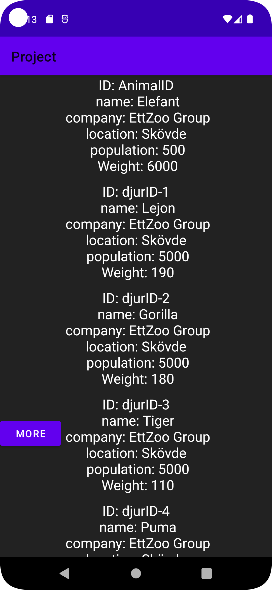
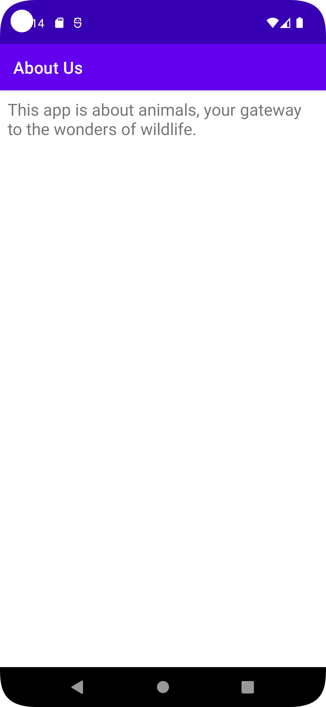
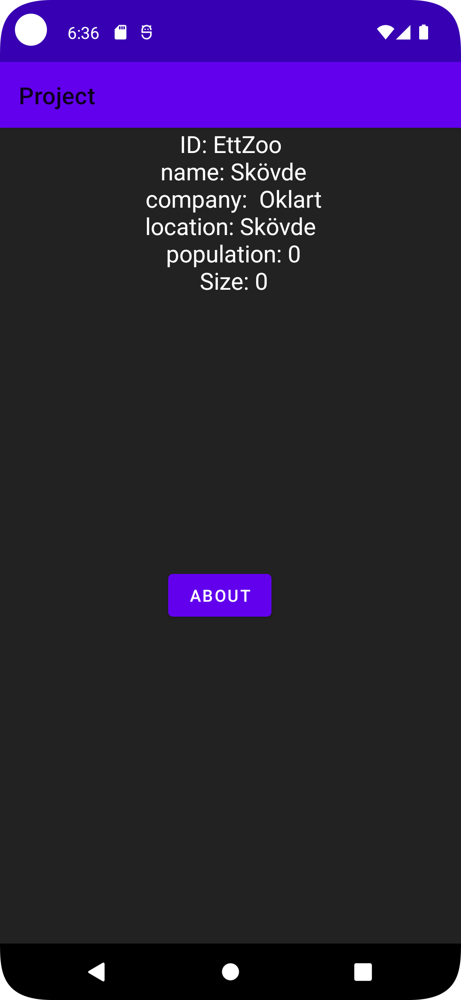
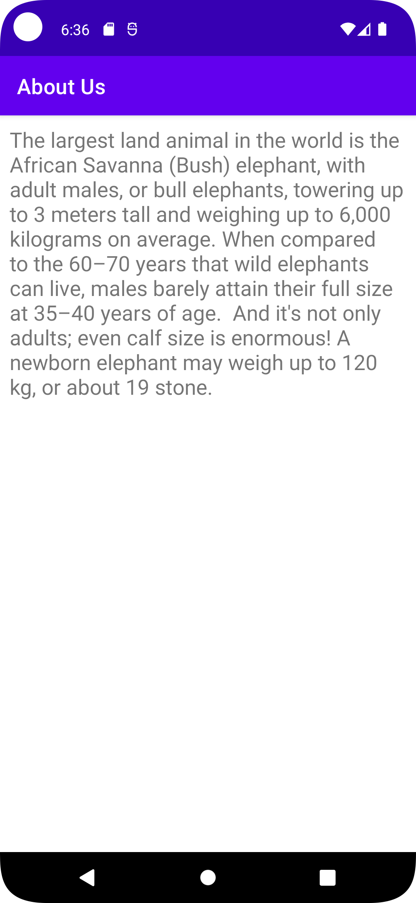

To begin with, A project was created from scratch, without any need of forks.
The main idea behind this app was to reuse code from screens assignment.
A problem was that JSON_URL seemingly did not update into app fast enough, unclear why. Old Json data stuck on app screen although changes were made in the admin interface, might have missed something though. 

A recyclerAdapter was used generally in the same way as the JSON and HTTPS assignment. 
SecondActivity contained intents declared in the main activity. 

```holder.JsonData.setText ("ID: " + ID + "\n name: " + name + "\n company: " + company + "\nlocation: " + location +"" + "\n population: " + population +"\n Size: " + size);```

Interesting warning here, it did not like the concatenation but rather creating a string of some sort. Unclear how to implement the suggested string type but code works fine with the concatenation. 


;
;



